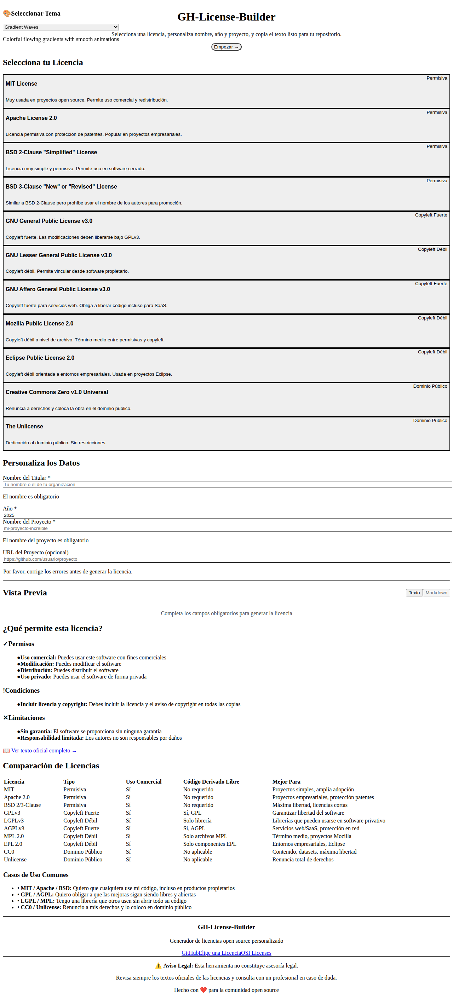
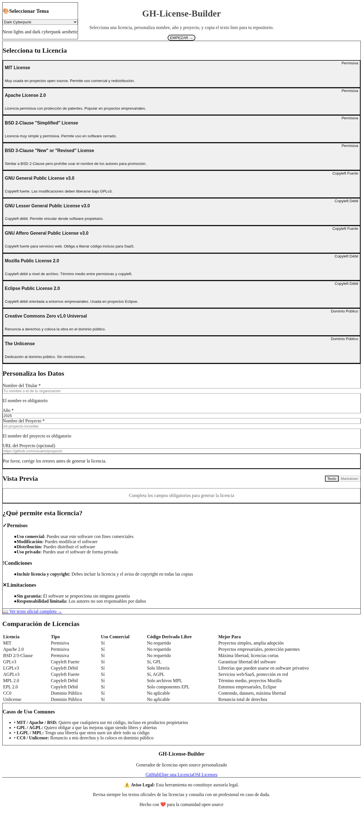
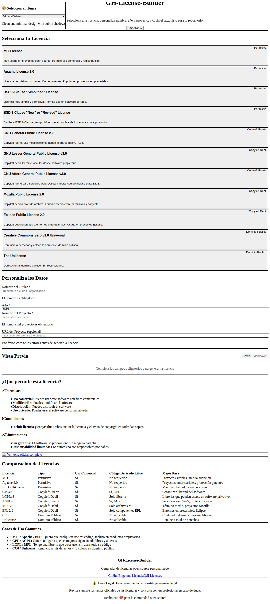
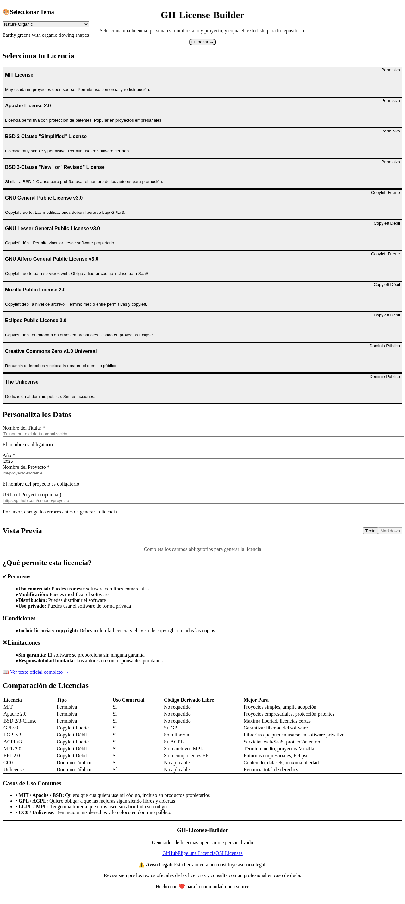
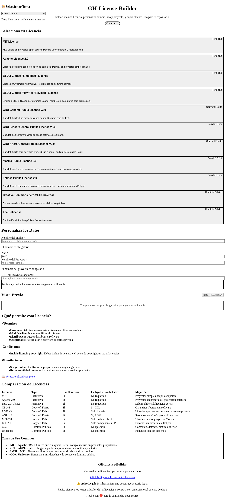
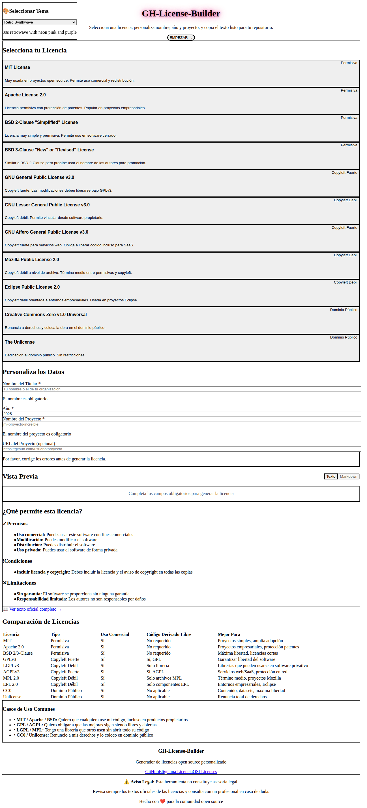
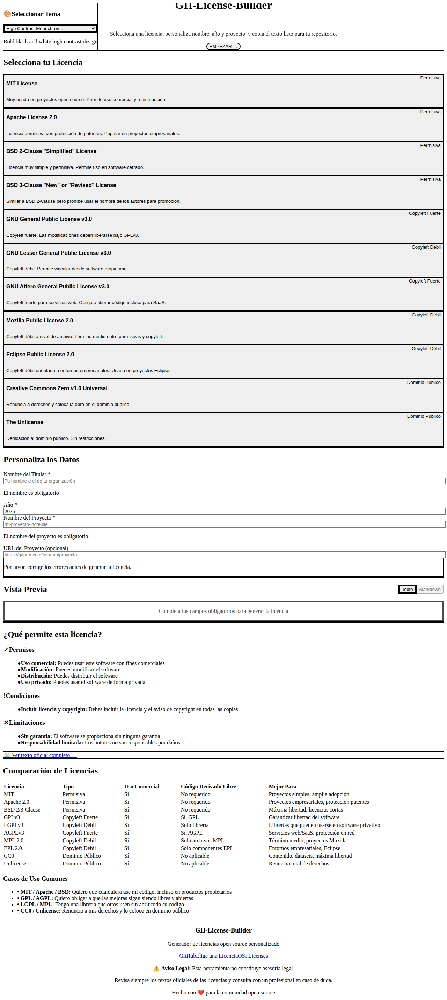
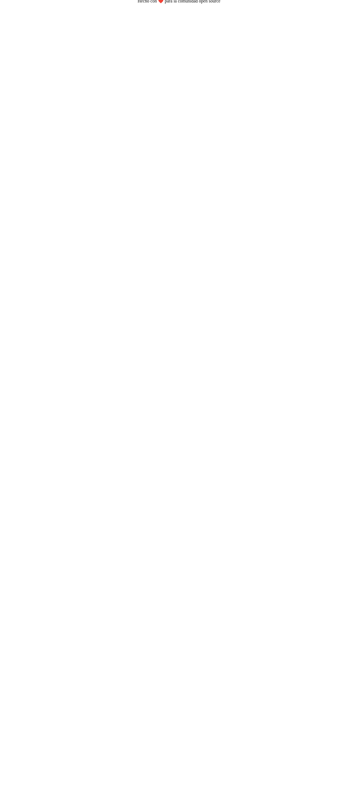
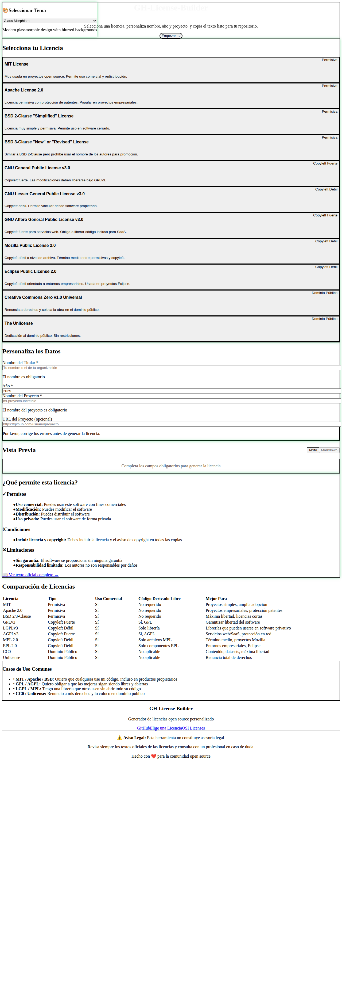
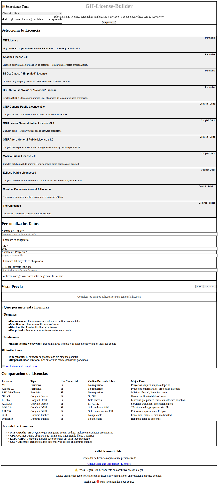

# 🎨 Guía de Temas de GH-License-Builder

Esta aplicación incluye **20 temas totalmente diferentes**, cada uno con su propio **layout estructural único**, colores, animaciones y estética. Los temas se pueden cambiar fácilmente usando el selector en la esquina superior derecha de la aplicación.

## 🆕 Novedad: Layouts Estructuralmente Diferentes

A diferencia de otros sistemas de temas que solo cambian colores, **cada tema en esta aplicación tiene un layout completamente diferente** que reorganiza el contenido de manera única:

- **Two-Column**: División clásica 50/50 izquierda/derecha
- **Single-Column**: Apilamiento vertical centrado
- **Three-Column**: División en 3 columnas equilibradas
- **Sidebar-Left**: Barra lateral estrecha a la izquierda con contenido amplio
- **Sidebar-Right**: Contenido principal amplio con sidebar derecha
- **Tabs**: Navegación por pestañas estilo wizard
- **Accordion**: Secciones colapsables tipo acordeón
- **Cards-Grid**: Grid de tarjetas con tamaños asimétricos
- **Masonry**: Diseño escalonado tipo Pinterest
- **Dashboard**: Estilo dashboard con preview destacado

El mismo contenido se presenta de **formas completamente diferentes** según el tema seleccionado.

## 📋 Tabla de Contenidos

- [¿Cómo Cambiar de Tema?](#cómo-cambiar-de-tema)
- [Lista Completa de Temas](#lista-completa-de-temas)
- [Características Técnicas](#características-técnicas)
- [Personalización](#personalización)

---

## 🔄 ¿Cómo Cambiar de Tema?

### Opción 1: Usar el Selector de Tema (Recomendado)

1. Abre la aplicación en tu navegador
2. Busca el selector de tema en la **esquina superior derecha** (🎨 Seleccionar Tema)
3. Haz clic en el menú desplegable
4. Selecciona el tema que prefieras
5. ¡El tema se aplicará inmediatamente y se guardará en tu navegador!

### Opción 2: Editar el Código

Si quieres establecer un tema por defecto diferente, puedes editar el archivo `src/data/themes.ts`:

```typescript
// En src/contexts/ThemeContext.tsx, línea 18
const [currentTheme, setCurrentTheme] = useState<Theme>(themes[0]); // themes[0] es el primer tema

// Cambia el índice para establecer un tema diferente por defecto:
const [currentTheme, setCurrentTheme] = useState<Theme>(themes[1]); // Dark Cyberpunk
const [currentTheme, setCurrentTheme] = useState<Theme>(themes[6]); // Retro Synthwave
```

O puedes cambiar el tema por defecto usando el ID del tema:

```typescript
// En src/contexts/ThemeContext.tsx
const defaultTheme = themes.find(t => t.id === 'retro-synthwave') || themes[0];
const [currentTheme, setCurrentTheme] = useState<Theme>(defaultTheme);
```

---

## 🎨 Lista Completa de Temas

### 1. **Gradient Waves** (Por Defecto)
- **ID**: `gradient-waves`
- **Layout**: Two-Column (división clásica izquierda/derecha)
- **Descripción**: Gradientes coloridos con animaciones suaves
- **Colores**: Azul, púrpura, rosa
- **Estilo**: Moderno, vibrante, profesional
- **Mejor para**: Uso general, presentaciones



---

### 2. **Dark Cyberpunk**
- **ID**: `dark-cyberpunk`
- **Layout**: Sidebar-Right (contenido amplio + sidebar derecha)
- **Descripción**: Estética cyberpunk oscura con luces neón
- **Colores**: Negro, cian, rosa
- **Estilo**: Futurista, tecnológico, dramático
- **Animaciones**: Pulso lento, bordes brillantes
- **Mejor para**: Proyectos tecnológicos, aplicaciones de desarrollo



---

### 3. **Minimal White**
- **ID**: `minimal-white`
- **Layout**: Single-Column (apilamiento vertical centrado)
- **Descripción**: Diseño minimalista limpio con sombras sutiles
- **Colores**: Blanco, gris
- **Estilo**: Minimalista, elegante, simple
- **Mejor para**: Documentación, presentaciones formales



---

### 4. **Nature Organic**
- **ID**: `nature-organic`
- **Layout**: Three-Column (3 columnas equilibradas)
- **Descripción**: Verdes terrosos con formas orgánicas fluidas
- **Colores**: Verde, esmeralda, turquesa
- **Estilo**: Natural, relajante, ecológico
- **Animaciones**: Flotación suave
- **Mejor para**: Proyectos ecológicos, aplicaciones de sostenibilidad



---

### 5. **Ocean Depths**
- **ID**: `ocean-depths`
- **Layout**: Dashboard (preview destacado arriba)
- **Descripción**: Azul océano profundo con animaciones de olas
- **Colores**: Azul oscuro, cian, turquesa
- **Estilo**: Profundo, tranquilo, fluido
- **Animaciones**: Ondas, efecto ripple
- **Mejor para**: Aplicaciones marinas, proyectos acuáticos



---

### 6. **Sunset Warm**
- **ID**: `sunset-warm`
- **Layout**: Cards-Grid (grid asimétrico de tarjetas)
- **Descripción**: Colores cálidos de atardecer con acentos dorados
- **Colores**: Naranja, rojo, amarillo
- **Estilo**: Cálido, acogedor, energético
- **Mejor para**: Proyectos creativos, portfolios

---

### 7. **Retro Synthwave**
- **ID**: `retro-synthwave`
- **Layout**: Sidebar-Left (sidebar estrecha izquierda)
- **Descripción**: Retroonda de los 80 con neón rosa y púrpura
- **Colores**: Rosa neón, púrpura, azul
- **Estilo**: Retro, nostálgico, vibrante
- **Animaciones**: Pulso neón, movimiento de grilla
- **Mejor para**: Proyectos retro, aplicaciones de música



---

### 8. **Corporate Professional**
- **ID**: `corporate-professional`
- **Layout**: Tabs (navegación por pestañas tipo wizard)
- **Descripción**: Tema profesional de negocios con tonos azules
- **Colores**: Azul oscuro, gris pizarra
- **Estilo**: Profesional, corporativo, confiable
- **Mejor para**: Presentaciones empresariales, aplicaciones B2B

---

### 9. **Aurora Borealis**
- **ID**: `aurora-borealis`
- **Layout**: Masonry (diseño escalonado tipo Pinterest)
- **Descripción**: Luces del norte con colores fluidos
- **Colores**: Verde, azul, púrpura
- **Estilo**: Mágico, etéreo, fascinante
- **Animaciones**: Efecto aurora, shimmer
- **Mejor para**: Proyectos creativos, portfolios artísticos

---

### 10. **Space Galaxy**
- **ID**: `space-galaxy`
- **Layout**: Accordion (secciones colapsables)
- **Descripción**: Espacio profundo con estrellas y nebulosas
- **Colores**: Negro, púrpura, azul
- **Estilo**: Espacial, misterioso, profundo
- **Animaciones**: Estrellas parpadeantes, flotación
- **Mejor para**: Proyectos de astronomía, ciencia ficción

---

### 11. **Pastel Dreamy**
- **ID**: `pastel-dreamy`
- **Layout**: Two-Column RTL (dirección derecha a izquierda)
- **Descripción**: Colores pastel suaves con atmósfera soñadora
- **Colores**: Rosa pastel, púrpura, azul
- **Estilo**: Suave, romántico, delicado
- **Mejor para**: Proyectos creativos, blogs, portfolios

---

### 12. **High Contrast Monochrome**
- **ID**: `high-contrast-mono`
- **Layout**: Single-Column (vertical compacto)
- **Descripción**: Diseño audaz en blanco y negro de alto contraste
- **Colores**: Negro, blanco
- **Estilo**: Audaz, minimalista, impactante
- **Mejor para**: Accesibilidad, diseño editorial



---

### 13. **Fire & Ember**
- **ID**: `fire-ember`
- **Layout**: Cards-Grid (grid con glassmorphism)
- **Descripción**: Colores calientes de fuego con efectos brillantes
- **Colores**: Rojo, naranja, amarillo
- **Estilo**: Caliente, enérgico, intenso
- **Animaciones**: Parpadeo, pulso de brasa
- **Mejor para**: Proyectos de acción, gaming

---

### 14. **Ice & Frost**
- **ID**: `ice-frost`
- **Layout**: Sidebar-Right (sidebar con efecto cristal)
- **Descripción**: Azul hielo frío con efectos cristalinos
- **Colores**: Azul hielo, cian, blanco
- **Estilo**: Frío, cristalino, elegante
- **Animaciones**: Brillo de escarcha
- **Mejor para**: Proyectos de invierno, aplicaciones médicas

---

### 15. **Forest Woodland**
- **ID**: `forest-woodland`
- **Layout**: Three-Column (columnas con animaciones)
- **Descripción**: Verdes de bosque profundo con texturas naturales
- **Colores**: Verde oscuro, esmeralda, lima
- **Estilo**: Natural, tranquilo, orgánico
- **Animaciones**: Movimiento de hojas
- **Mejor para**: Proyectos ecológicos, naturaleza

---

### 16. **Desert Sand**
- **ID**: `desert-sand`
- **Layout**: Dashboard (espaciado relaxed)
- **Descripción**: Tonos cálidos de desierto con texturas arenosas
- **Colores**: Ámbar, naranja, amarillo
- **Estilo**: Cálido, terroso, natural
- **Mejor para**: Proyectos de viajes, geografía

---

### 17. **Neon Matrix**
- **ID**: `neon-matrix`
- **Layout**: Tabs (pestañas compactas)
- **Descripción**: Código verde estilo Matrix con efectos digitales
- **Colores**: Verde neón, negro
- **Estilo**: Digital, hacker, tecnológico
- **Animaciones**: Lluvia de matriz, glitch
- **Mejor para**: Proyectos de programación, seguridad



---

### 18. **Candy Playful**
- **ID**: `candy-playful`
- **Layout**: Masonry (fluido con rebote)
- **Descripción**: Colores dulces de caramelo con vibra juguetona
- **Colores**: Rosa chicle, púrpura, azul
- **Estilo**: Divertido, juguetón, alegre
- **Animaciones**: Rebote suave, wiggle
- **Mejor para**: Proyectos infantiles, aplicaciones lúdicas



---

### 19. **Newspaper Print**
- **ID**: `newspaper-print`
- **Layout**: Accordion (acordeón compacto)
- **Descripción**: Diseño clásico de periódico con fuentes serif
- **Colores**: Blanco, negro, gris
- **Estilo**: Clásico, editorial, tradicional
- **Mejor para**: Blogs, artículos, documentación

---

### 20. **Glass Morphism**
- **ID**: `glass-morphism`
- **Layout**: Sidebar-Left (glass con blur)
- **Descripción**: Diseño glassmórfico moderno con fondos difuminados
- **Colores**: Multicolor con transparencias
- **Estilo**: Moderno, elegante, sofisticado
- **Animaciones**: Movimiento de gradiente
- **Mejor para**: Aplicaciones modernas, portfolios



---

## 🛠️ Características Técnicas

### Sistema de Layouts Dinámicos

El sistema de temas incluye **10 tipos de layouts estructuralmente diferentes** que reorganizan el contenido de formas únicas:

#### 1. Two-Column Layout
- División clásica 50/50 izquierda/derecha
- Configuración en un lado, preview en el otro
- **Usado por**: Gradient Waves, Pastel Dreamy

#### 2. Single-Column Layout
- Apilamiento vertical centrado
- Todo el contenido fluye de arriba a abajo
- Ideal para lectura lineal
- **Usado por**: Minimal White, High Contrast

#### 3. Three-Column Layout
- Divide el espacio en 3 columnas equilibradas
- Selector | Configuración | Preview
- Uso eficiente del espacio horizontal
- **Usado por**: Nature Organic, Forest Woodland

#### 4. Sidebar-Left Layout
- Barra lateral estrecha a la izquierda (~320px)
- Contenido principal amplio a la derecha
- Navegación compacta
- **Usado por**: Retro Synthwave, Glass Morphism

#### 5. Sidebar-Right Layout
- Contenido principal amplio a la izquierda
- Sidebar de personalización a la derecha (~384px)
- Preview e info tienen más espacio
- **Usado por**: Dark Cyberpunk, Ice & Frost

#### 6. Tabs Layout
- Navegación por pestañas estilo wizard
- Cambio entre secciones con tabs superiores
- Flujo paso a paso: Seleccionar → Personalizar → Preview → Info → Comparar
- **Usado por**: Corporate Professional, Neon Matrix

#### 7. Accordion Layout
- Secciones colapsables tipo acordeón
- Solo una sección visible a la vez
- Ahorra espacio vertical
- Interacción click para expandir/colapsar
- **Usado por**: Space Galaxy, Newspaper Print

#### 8. Cards-Grid Layout
- Grid asimétrico de tarjetas
- Diferentes tamaños de tarjetas (2x1, 1x1, etc.)
- Diseño dinámico y moderno
- **Usado por**: Sunset Warm, Fire & Ember

#### 9. Masonry Layout
- Diseño escalonado tipo Pinterest
- CSS columns para layout fluido
- Tarjetas se adaptan a contenido
- **Usado por**: Aurora Borealis, Candy Playful

#### 10. Dashboard Layout
- Estilo dashboard con preview destacado arriba
- Grid de diferentes tamaños
- Preview ocupa 2/3 del ancho superior
- **Usado por**: Ocean Depths, Desert Sand

### Arquitectura del Sistema de Temas

El sistema de temas está construido con:

- **React Context API**: Para la gestión del estado del tema
- **TypeScript**: Para type-safety completo
- **TailwindCSS**: Para estilos utilitarios
- **CSS Custom Animations**: Para animaciones personalizadas
- **LocalStorage**: Para persistencia del tema seleccionado

### Estructura de un Tema

Cada tema incluye:

```typescript
interface Theme {
  id: string;                    // Identificador único
  name: string;                  // Nombre mostrado
  description: string;           // Descripción breve
  
  layout: {                      // Configuración de layout
    type: 'two-column' | 'single-column' | 'three-column' | 
          'sidebar-left' | 'sidebar-right' | 'tabs' | 
          'accordion' | 'cards-grid' | 'masonry' | 'dashboard';
    heroStyle: 'gradient' | 'solid' | 'pattern' | 'animated' | 'minimal' | 'split';
    cardStyle: 'rounded' | 'sharp' | 'glass' | 'neumorphic' | 'elevated' | 'flat';
    spacing: 'compact' | 'normal' | 'relaxed' | 'wide';
    direction: 'ltr' | 'rtl';   // Dirección del texto
  };
  
  background: {                  // Colores de fondo
    main: string;                // Fondo principal
    hero: string;                // Fondo del hero
    card: string;                // Fondo de tarjetas
    cardHover: string;           // Hover de tarjetas
  };
  
  text: {                        // Colores de texto
    primary: string;
    secondary: string;
    hero: string;
    accent: string;
  };
  
  animations: {                  // Animaciones
    backgroundAnimation?: string;
    cardAnimation?: string;
    heroAnimation?: string;
  };
  
  button: {                      // Estilos de botón
    primary: string;
    hover: string;
    text: string;
  };
}
```

### Componentes de Layout

Cada layout es un componente React independiente en `src/layouts/`:

- `TwoColumnLayout.tsx` - Grid 2 columnas
- `SingleColumnLayout.tsx` - Stack vertical
- `ThreeColumnLayout.tsx` - Grid 3 columnas
- `SidebarLeftLayout.tsx` - Flex con sidebar izquierda
- `SidebarRightLayout.tsx` - Flex con sidebar derecha
- `TabsLayout.tsx` - Navegación con tabs y estado
- `AccordionLayout.tsx` - Secciones colapsables con estado
- `CardsGridLayout.tsx` - Grid asimétrico
- `MasonryLayout.tsx` - CSS columns
- `DashboardLayout.tsx` - Grid tipo dashboard

El layout se selecciona dinámicamente en `App.tsx` según el tema actual:

```typescript
const renderLayout = () => {
  switch (currentTheme.layout.type) {
    case 'single-column': return <SingleColumnLayout {...props} />;
    case 'three-column': return <ThreeColumnLayout {...props} />;
    case 'sidebar-left': return <SidebarLeftLayout {...props} />;
    // ... etc
  }
};
```

### Animaciones Disponibles

El sistema incluye más de 20 animaciones CSS personalizadas:

- `animate-gradient-x` - Gradiente animado horizontal
- `animate-float` - Flotación suave
- `animate-fade-in` - Aparición gradual
- `animate-pulse-slow` - Pulso lento
- `animate-flicker` - Parpadeo
- `animate-wave` - Efecto de ola
- `animate-shimmer` - Brillo
- `animate-neon-pulse` - Pulso neón
- `animate-aurora` - Efecto aurora
- `animate-stars` - Estrellas parpadeantes
- `animate-glitch` - Efecto glitch
- Y muchas más...

---

## 🎯 Personalización

### Crear un Nuevo Tema

1. Abre el archivo `src/data/themes.ts`
2. Agrega un nuevo objeto de tema al array `themes`:

```typescript
{
  id: 'mi-tema-personalizado',
  name: 'Mi Tema Personalizado',
  description: 'Descripción de mi tema',
  background: {
    main: 'bg-gradient-to-br from-color-500 to-color-700',
    hero: 'bg-gradient-to-r from-color-600 to-color-800',
    card: 'bg-white',
    cardHover: 'hover:shadow-2xl',
  },
  text: {
    primary: 'text-gray-900',
    secondary: 'text-gray-600',
    hero: 'text-white',
    accent: 'text-color-600',
  },
  animations: {
    backgroundAnimation: 'animate-gradient-x',
    cardAnimation: 'transition-all duration-300',
    heroAnimation: 'animate-fade-in',
  },
  layout: {
    heroStyle: 'gradient',
    cardStyle: 'rounded',
    spacing: 'normal',
  },
  button: {
    primary: 'bg-color-600 text-white',
    hover: 'hover:bg-color-700',
    text: 'font-semibold',
  },
}
```

3. Guarda el archivo y recarga la aplicación
4. Tu nuevo tema aparecerá en el selector

### Modificar un Tema Existente

1. Abre `src/data/themes.ts`
2. Encuentra el tema que quieres modificar por su `id`
3. Modifica las propiedades que desees
4. Guarda y recarga

### Agregar Nuevas Animaciones

1. Abre `src/index.css`
2. Agrega tu keyframe personalizado:

```css
@keyframes mi-animacion {
  0% { transform: scale(1); }
  50% { transform: scale(1.1); }
  100% { transform: scale(1); }
}

.animate-mi-animacion {
  animation: mi-animacion 2s ease-in-out infinite;
}
```

3. Usa la clase en tu tema: `animate-mi-animacion`

---

## 💡 Tips y Mejores Prácticas

1. **Accesibilidad**: Asegúrate de que haya suficiente contraste entre texto y fondo
2. **Rendimiento**: Evita animaciones muy pesadas en dispositivos móviles
3. **Consistencia**: Mantén un esquema de colores coherente en todo el tema
4. **Testing**: Prueba cada tema en diferentes dispositivos y navegadores
5. **Persistencia**: El tema seleccionado se guarda automáticamente en localStorage

---

## 🐛 Solución de Problemas

### El tema no se aplica correctamente

- Verifica que los nombres de las clases de TailwindCSS sean válidos
- Asegúrate de que las animaciones CSS estén definidas en `index.css`
- Limpia el caché del navegador y recarga

### El tema no se guarda

- Verifica que localStorage esté habilitado en tu navegador
- Comprueba la consola del navegador por errores

### Las animaciones no funcionan

- Asegúrate de que las animaciones estén definidas en `index.css`
- Verifica que los nombres de las clases sean correctos
- Comprueba que no haya conflictos con otras animaciones CSS

---

## 📚 Recursos Adicionales

- [Documentación de TailwindCSS](https://tailwindcss.com/docs)
- [Guía de Animaciones CSS](https://developer.mozilla.org/es/docs/Web/CSS/CSS_Animations)
- [React Context API](https://react.dev/reference/react/useContext)
- [TypeScript](https://www.typescriptlang.org/)

---

## 🤝 Contribuir

¿Tienes ideas para nuevos temas? ¡Las contribuciones son bienvenidas!

1. Fork del repositorio
2. Crea un nuevo tema en `src/data/themes.ts`
3. Toma screenshots del nuevo tema
4. Actualiza este documento (THEMES.md)
5. Crea un Pull Request

---

## 📝 Licencia

Este proyecto y todos sus temas están bajo la licencia GPL-3.0. Ver el archivo [LICENSE](LICENSE) para más detalles.

---

<div align="center">

**¡Disfruta personalizando tu experiencia con GH-License-Builder!** 🎨

Hecho con ❤️ por la comunidad open source

</div>
